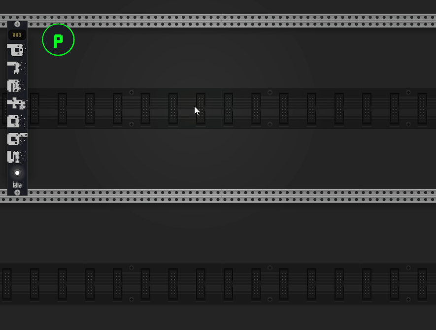

<h1 align="center">Prefabs</h1>

Quick patch prefabs and modules for <a href="https://vcvrack.com/">VCV Rack</a>.

## What are Prefabs?

Prefabs are reusable selections saved to disk. They usually contain multiple pre-wired modules.

The prefabs can then be pulled into a patch by right-clicking on the Prefabs widget:

## The Prefabs Module

The Prefabs module is simple and shows you how many prefabs you have available at the top.

### The Widget toggle

Towards the buttom, a button will show/hide the Prefabs Widget

The widget can be moved, and will stay in the same position as you move the rack around.

## The Prefabs menu

Right-clicking on the Prefabs widget will bring up a menu where you can access your prefabs and modules.

### Local Prefabs

Below the search box, you will all of your local prefabs, organized by tag.

Below the tag list, there is a sub-menu `by module:` where your prefabs are organized by the module they use.

### Plugin Prefabs

VCV Plugins can also provide prefabs. These are listed in the `Plugin Prefabs` menu.

### Modules Library

At the bottom of the menu, you will find your favorite modules. These modules can be pulled into the patch just like
prefabs.

Pressing `ctrl` will show all modules, not just the ones you have favorited.

