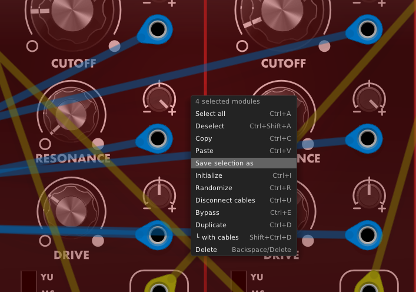
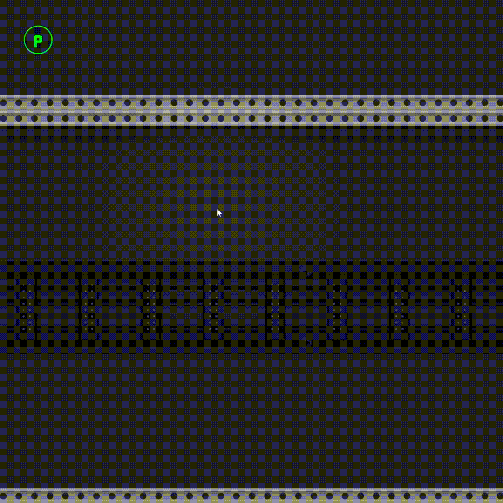
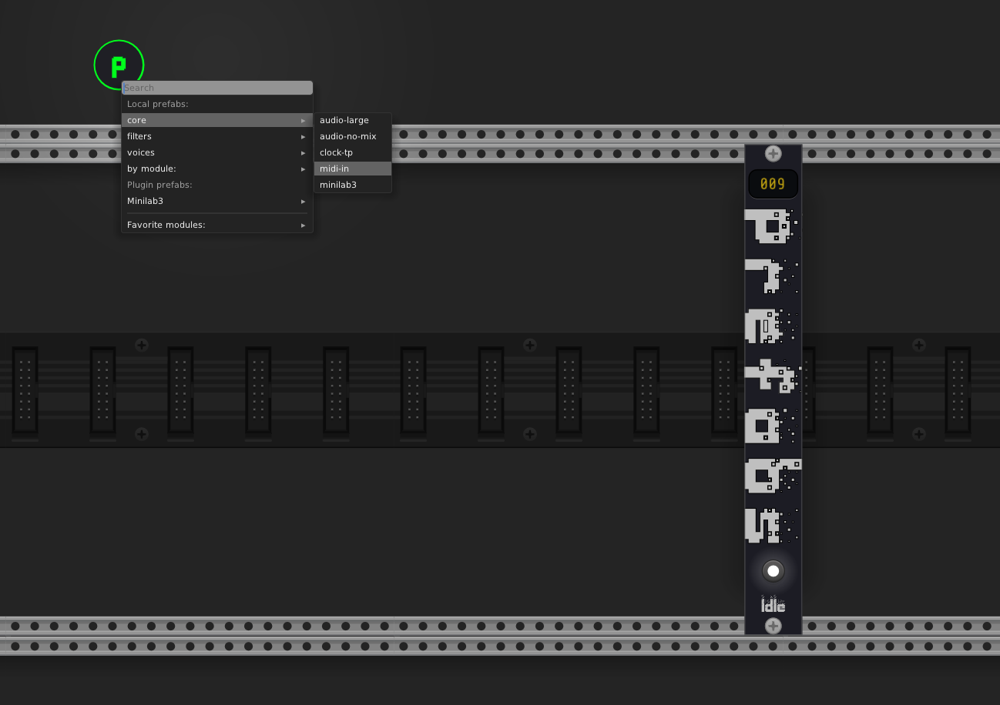
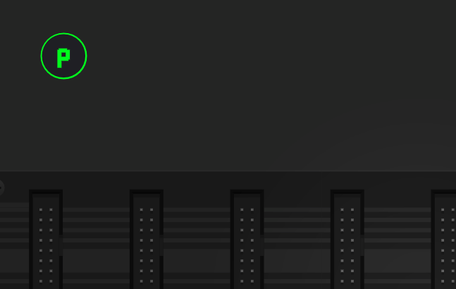

<h1 align="center">Prefabs</h1>

Quick patch prefabs and modules for <a href="https://vcvrack.com/">VCV Rack</a>.

## What are Prefabs?

Prefabs are reusable selections saved to disk. They usually contain multiple pre-wired modules.

The prefabs can then be pulled into a patch by right-clicking on the Prefabs widget:

## The Prefabs Module

The Prefabs module is simple and shows you how many prefabs you have available at the top.

### The Widget toggle

Towards the buttom, a button will show/hide the Prefabs Widget

The widget can be moved, and will stay in the same position as you move the rack around.

## The Prefabs menu

Right-clicking on the Prefabs widget will bring up a menu where you can access your prefabs and modules.

