<h1 align="center">Prefabs</h1>

Quick patch prefabs and modules for <a href="https://vcvrack.com/">VCV Rack</a>.

## What are Prefabs?

Prefabs are reusable selections saved to disk. They usually contain multiple pre-wired modules.

The prefabs can then be pulled into a patch by right-clicking on the Prefabs widget:

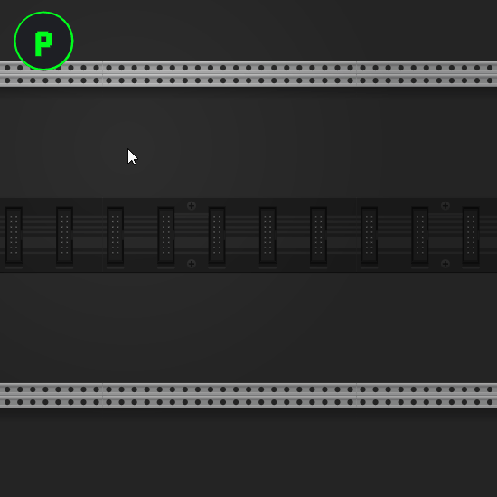

## The Prefabs Module

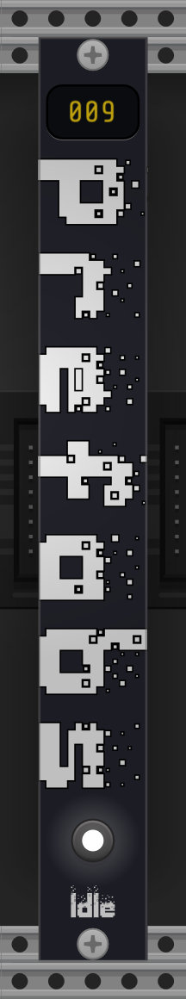

The Prefabs state is simple and shows you how many prefabs you have available at the top.

### The Widget toggle

Towards the buttom, a button will show/hide the Prefabs Widget

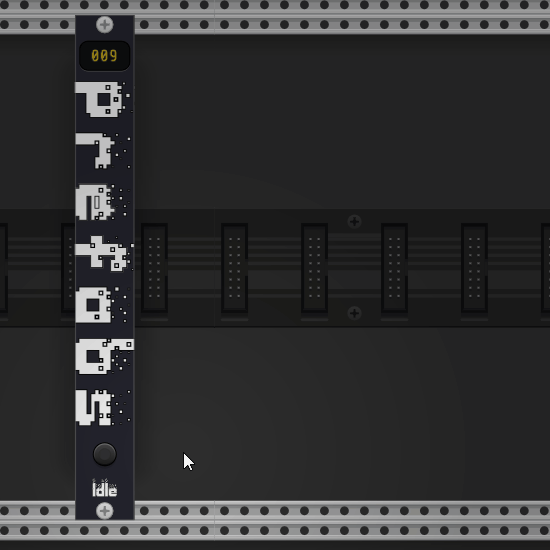

The widget can be moved, and will stay in the same position as you move the rack around.

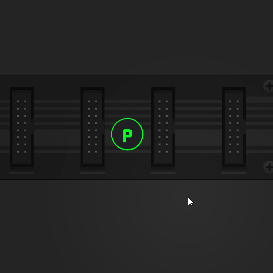

## The Prefabs menu

Right-clicking on the Prefabs widget will bring up a menu where you can access your prefabs and modules.

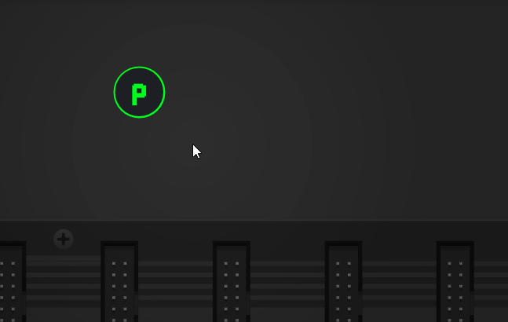

### Local Prefabs

Below the search box, you will all of your local prefabs, organized by tag.

Just click or drag the prefab into the patch.

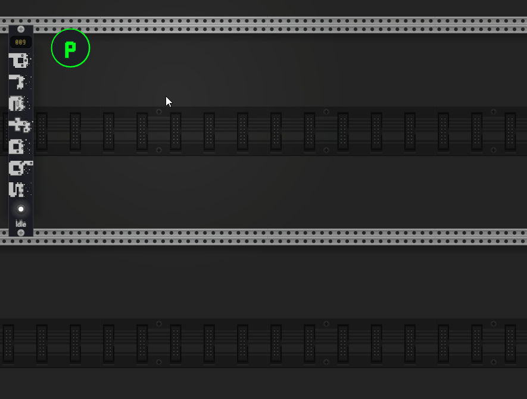

Below the tag list, there is a sub-menu `by module:` where your prefabs are organized by the modules they use.

### Plugin Prefabs

VCV Plugins can also provide prefabs. These are listed in the `Plugin Prefabs` menu.

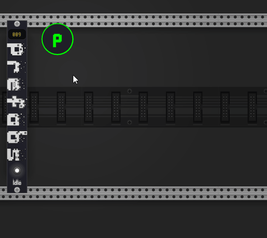

### Modules Library

At the bottom of the menu, you will find your favorite modules. These modules can be pulled into the patch just like
prefabs.

Pressing `ctrl` will show all modules, not just the ones you have favorited.

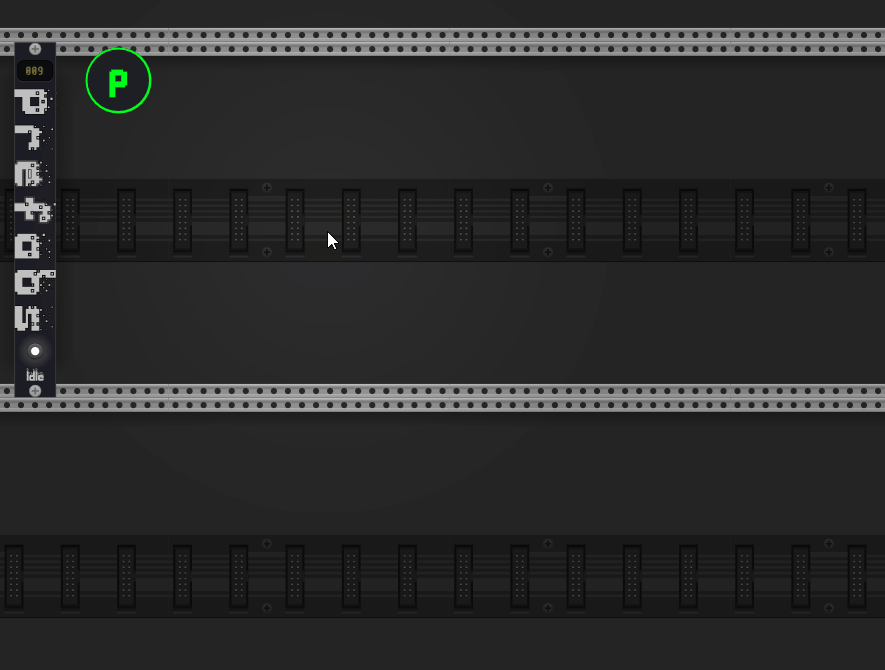

#### Adding favorites

Right-clicking on a state will bring up a menu where you can add it to your favorites.

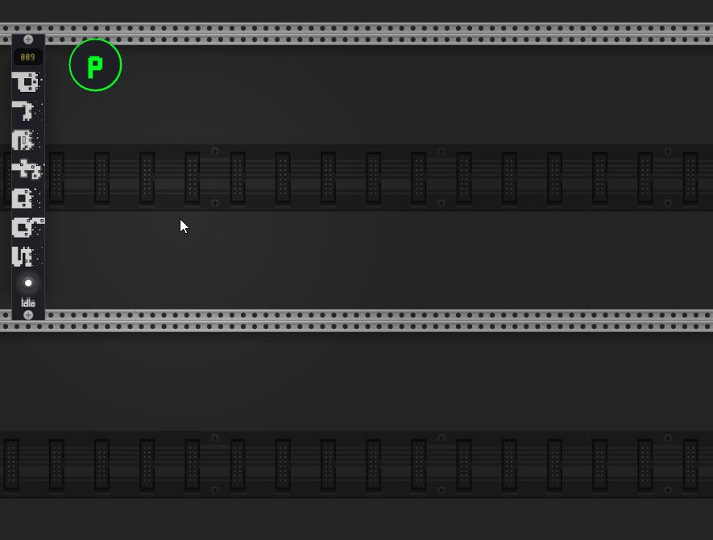

### Searching

By typing into the search box, you can filter the prefabs and modules.

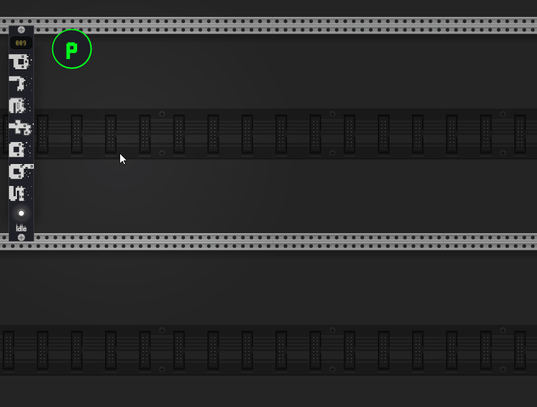

# Saving Prefabs

To save a prefab, select some modules, right-click and pick `Save selection as...`

This will open the save dialog. Save your prefab under a folder to give it a tag.

# Settings

Right-clicking the Prefabs state will bring up a menu where you can change some settings.

## Search results

You can control the number of results shown in the search box.

## Widget color

You can change the color of the Prefabs widget.

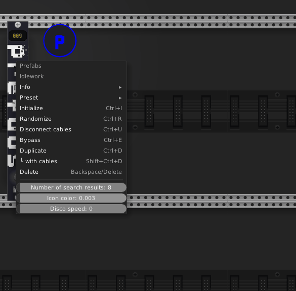

## Disco mode

Increasing disco speed above 0 will cause the widget color to change over time.

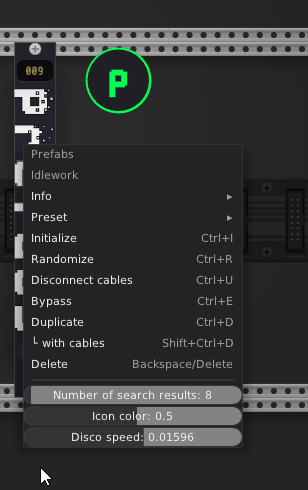

